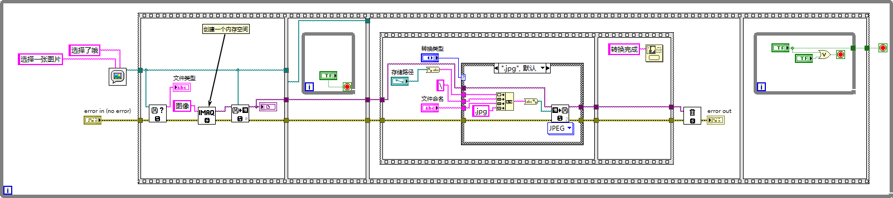
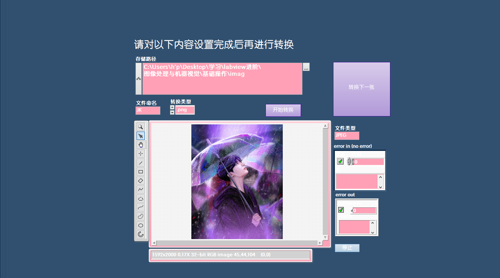

## Labview读写各类格式图像

#### 1、图像文件格式

​	常见的标准图像文件格式有：`BMP(Bitmap，位图)`、`TIFF(Tagged lmage File Format)`、`PNG(Portable NetworkGraphics)`、`JPEG(Joint Photographic Experts Group)`等。如果需要，也可开发保存浮点数、复数或HSL类型图像的专用图像文件格式或将连续多帧图像数据保存在AVI(Audio VideoInterleaved)视频格式的文件中。

##### 1.1指标

###### 1）有损VS无损

​	`有损压缩`，在压缩文件大小的过程中，损失了一部分图片的信息，也即降低了图片的质量，并且这种损失是不可逆的，我们不可能从有一个有损压缩过的图片中恢复出全来的图片。常见的有损压缩手段，是按照一定的算法将临近的像素点进行合并。
​	`无损压缩`，在压缩文件大小的过程中，图片的质量没有任何损耗。我们任何时候都可以从无损压缩过的图片中恢复出原来的信息。

###### 2）索引色VS直接色

​	计算机在表示颜色的时候，有两种形式，一种称作索引颜色([Index Color](https://link.zhihu.com/?target=https%3A//en.wikipedia.org/wiki/Indexed_color))，一种称作直接颜色([Direct Color](https://link.zhihu.com/?target=https%3A//en.wikipedia.org/wiki/Color_depth%23Direct_color))。

- 索引色。用一个数字来代表（索引）一种颜色，在存储图片的时候，存储一个数字的组合，同时存储数字到图片颜色的映射。这种方式只能存储有限种颜色，通常是256种颜色，对应到计算机系统中，使用一个字节的数字来索引一种颜色。
- 直接色。使用四个数字来代表一种颜色，这四个数字分别代表这个颜色中红色、绿色、蓝色以及透明度。现在流行的显示设备可以在这四个维度分别支持256种变化，所以直接色可以表示2的32次方种颜色。当然并非所有的直接色都支持这么多种，为压缩空间使用，有可能只有表达红、绿、蓝的三个数字，每个数字也可能不支持256种变化之多。

###### 3）点阵图VS矢量图

- 点阵图，也叫做位图，像素图。构成点阵图的最小单位是象素，位图就是由象素阵列的排列来实现其显示效果的，每个象素有自己的颜色信息，在对位图图像进行编辑操作的时候，可操作的对象是每个象素，我们可以改变图像的色相、饱和度、明度，从而改变图像的显示效果。==点阵图缩放会失真==，用最近非常流行的沙画来比喻最恰当不过，当你从远处看的时候，画面细腻多彩，但是当你靠的非常近的时候，你就能看到组成画面的每粒沙子以及每个沙粒的颜色。
- 矢量图，也叫做向量图。矢量图并不纪录画面上每一点的信息，而是==纪录了元素形状及颜色的算法==，当你打开一付矢量图的时候，软件对图形象对应的函数进行运算，将运算结果（图形的形状和颜色）显示给你看。无论显示画面是大还是小，画面上的对象对应的算法是不变的，所以，==即使对画面进行倍数相当大的缩放，其显示效果仍然相同(不失真)==。

##### 1.2对比

| 格式 | 特点                                                         | 优点                                 | 缺点                                                         | 应用                                                         |
| ---- | ------------------------------------------------------------ | ------------------------------------ | ------------------------------------------------------------ | ------------------------------------------------------------ |
| BMP  | Bitmap（位图），图像信息较丰富，几乎不进行压缩               | 同时支持索引色和直接色               | 占用磁盘空间过大                                             | Windows操作系统                                              |
| GIF  | Graphics Interchange Format（图形转换格式），采用LZW压缩算法进行编码，用于以超文本标志语言方式显示索引彩色图像 | 无损压缩，文件小，支持动画以及透明   | 仅支持8Bit的索引色，即在整个图片中，只能存在256种不同的颜色  | 因特网和其他在线服务系统，对色彩要求不高同时需要文件体积较小的场景，比如企业Logo、线框类的图等 |
| TIFF | Tag Image File Format（标签图像文件格式），对图像信息的存放灵活多变 | 支持很多色彩系统，独立于操作系统     | 图像格式很复杂                                               | 各种地理信息系统、摄影测量与遥感等应用                       |
| PNG  | Portable Network Graphics（便携式网络图形），无损压缩的位图片形格式，结合了GIF和TIFF优点，能够支持压缩不失真、透明背景、渐变图像的制作要求，有8位、24位、32位三种形式，其中8位PNG支持两种不同的透明形式（索引透明和alpha透明），24位PNG不支持透明，32位PNG在24位基础上增加了8位透明通道，因此可展现256级透明程度。 | 压缩比高，生成文件体积小             |                                                              | PS软件以及互联网                                             |
| JPG  | Joint Photographic Experts Group（图画格式），有损压缩       | 采用直接色，压缩比高，生成文件体积小 | 编辑和重新保存 JPG 文件时，JPG 会混合原始图片数据的质量下降，且这种下降是累积性的。 | 目前网络上最流行的图像格式                                   |
| SVG  | Scalable Vector Graphics（可缩放矢量图形），由直线和曲线以及绘制它们的方法组成，放大时，不会失真 | 方便修改                             |                                                              | 绘制企业Logo、Icon                                           |

#### 2、操作

##### 2.1 Labview集成图像读写函数

​	LabVIEW自身集成了对PNG、JPEG和BMP图像文件的支持，这些函数位于`图形与声音→图形格式函数选板`中，但只能进行较简单的图像处理，

##### 2.2 Nl Vision图像读写函数

​	支持常见的BMP、TIFF、PNG、JPEG等标准图像文件格式读写，还支持可存放连续多帧图像的AVI视频文件格式，并且可保存浮点数、复数或HSL类型图像的NI专用AIPD图像文件格式。

​	Nl Vision提供的图像文件操作VI包括图像文件信息获取VI、图像和视觉系统信息获取VI、图像文件读写VI以及AVI文件操作VI等。这些VI位于LabVIEW的**视觉与运动→Vision Utilities→Files函数选板**中，如下图所示：

​	调用这些VI可以快速读写BMP、TIFF、PNG等标准图像文件，也读取结构已知的非标准图像文件。当然也可以只获取文件中包含的与图像和机器视觉系统相关的信息，或使图像在不同的文件格式之间进行转换。使用说明请参照手册。

#### 3、实例---图片格式转换

​	实现`jpg`，`png`，`bmp`，`tiff`各种图片格式之间的转换

程序框图

前面板

