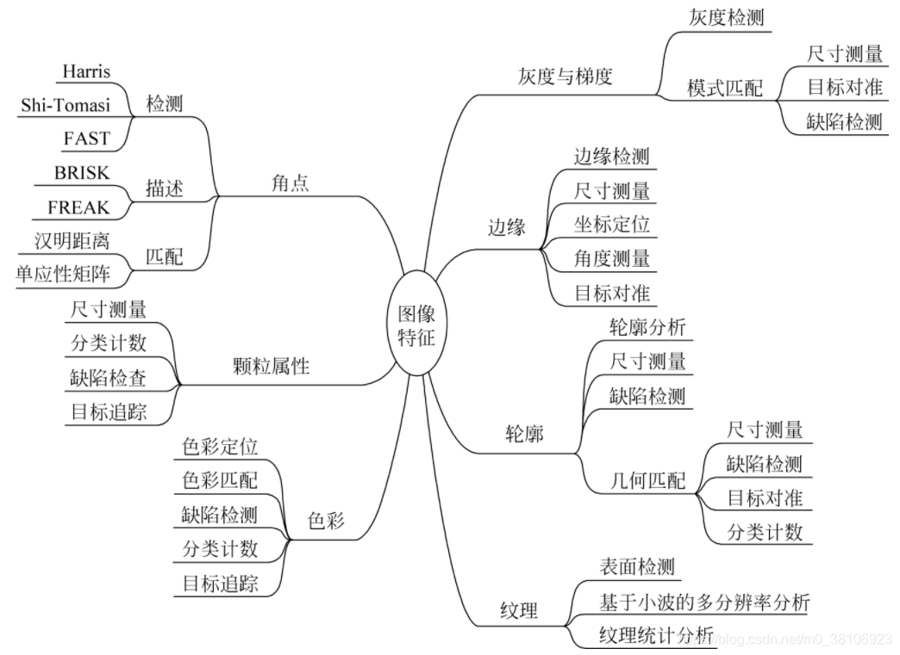

## 图像特征

图像的特征是指图像的原始特性或属性。

==自然特征==：像素灰度、边缘和轮廓、纹理及色彩等

==通过计算或变换才能得到的特征==：直方图、频谱和不变矩等

将属于特征的像素从图像中分离出来的过程称为图像的==特征提取==，从各种图像特征中选出可高效解决待处理问题的特征的过程则称为==特征选择==。

一个好的特征应与其他特征之间应有明显的差异，且对同类图像来说，其值应保持一致可靠，并具有代表性和独立性。

基于以上常见的图像特征，可以实现诸如`尺寸测量`（Dimension Measurement）、`目标检测`（Detection）、`缺陷检查`（Fault lnspection）、`目标对准`（Object Alignment）、`分类计数`（Sorting & Counting）以及`目标追踪`（Object Tracking）等机器视觉应用。

[不脱发的程序猿]: https://handsome-man.blog.csdn.net/article/details/118075567

