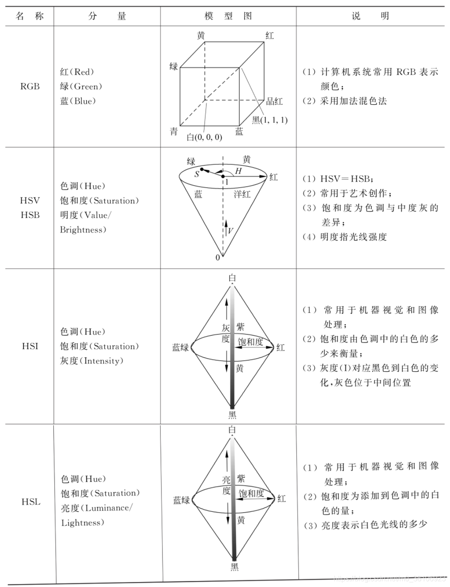

## 彩色图像色彩空间原理

​	色彩空间是指通过多个（通常为3个或4个）颜色分量构成坐标系来表示各种颜色的模型系统。色彩空间中的每个点均代表一种颜色，也就是说各点的颜色可看作是多个分量的合成。

​	彩色图像的处理计算工作就可以被分解至各颜色分量所对应的一组图像上进行，包括==图像增强和分割、色彩匹配、色彩定位、色彩模式识别分类以及彩色图像分割==等。

​	不同的工业环境或机器视觉应用使用的色彩空间可能各不相同。与图像处理相关的常见色彩空间有以下几种：

- RGB，包括红（Red）、绿（Green）、蓝（Blue）；
- HSV/HSB，包括色调（Hue）、饱和度（Saturation）和明度（Value/Brightness）；
- HSl，包括色调（Hue）、饱和度（Saturation）和灰度（Intensity）；
- HSL，包括色调（Hue）、饱和度（Saturation）和亮度

​	以上色彩空间中，==RGB被计算机显示器采用，HSV/HSB被艺术家用于艺术创作，HSl和HSL则适合机器视觉和图像处理系统开发==。

在机器视觉开发过程中，也会涉及以下几种色彩空间：

[参考]: https://blog.csdn.net/m0_38106923/article/details/119336224

