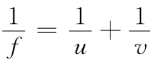
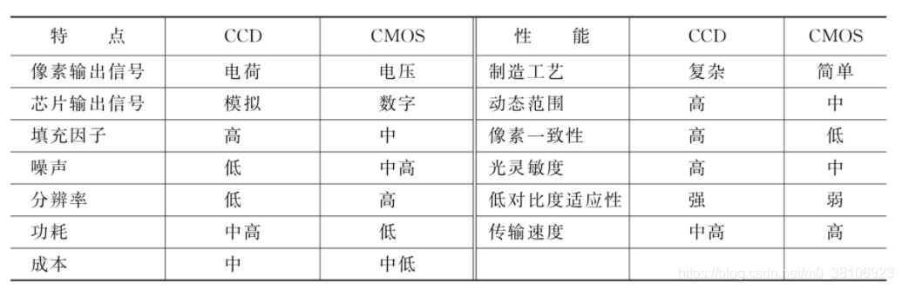

---

---

## 相机选型

#### 1、图像基础知识

​	图像分为`彩色图像 ` 和 `黑白（灰度）图像 `，自然界中的色彩可以分解为==不同强度RGB基本色的组合==，这种表示色彩的方式称为RGB颜色模型或RGB色彩空间，如下图所示：


​	所以，也可以将 ==彩色图像的研究== 分解为对 ==RGB分量所对应的灰度图像== 的研究。

##### 1.1图像类型

​	图像根据记录方式的不同可分为 `模拟图像` 和 `数字图像` 两大类。

​	如果将灰度图像看作二维空间(平面)上的光强度函数f (x，y)，则模拟灰度图像就是对该空间上光强度幅值f变化的连续记录。当(x，y)和f为离散、有限的数值时，光强度幅值f的变化将以类似矩阵的形式被记录，此时所记录的图像就称为`数字图像`，而所记录的值对应在图像中的每个点称为==`像素`==(pixel)，横向及纵向像素的个数称为图像的==`分辨率`==(image resolution)，如果是彩色数字图像，则在计算机中需要记录每个像素对应的RGB分量，如下图所示：


​	工业机器视觉系统中提及的图像通常就指数字图像。

##### 1.2分辨率

- `图像分辨率` 指图像中存储的信息量，是==每英寸图像内有多少个像素点==，分辨率的单位为`PPI`（Pixels Per Inch），通常叫做像素每英寸。图像分辨率一般被用于PS中，用来改变图像的清晰度。
- `系统分辨率` 指成像==系统可以识别出监测目标的最小细节或最小特征==。诸如“要求系统能检测0.1mm的目标"、"要求系统测量精度达到0.01mm"之类的要求一般都和系统分辨率相关。
- `像素分辨率` 指==为了表示检测目标所需要的像素数==。一般情况下，可以根据客户对检测目标中最小特征的要求来确定最小像素分辨率。如果将整个图像看作周期为最小特征大小的周期信号，则根据奈奎斯特采样定律，必须对信号每个周期采样2个点以上，才能完整恢复该信号。因此如果客户没有特别要求，常用至少两个像素来代表检测目标中的最小特征，这可被看作是图像传感器的奈奎斯特定律。

​	图像传感器应具备的最小像素分辨率常通过下面的公式计算：


​	在无特别要求时，pmin=2，如果客户要求使用多于2像素来表示最小特征，则最小分辨率将适当增加。

##### 1.3视场

​	视场（Field of View，FOV）指成像系统中图像传感器可以监测到的最大区域。在机器视觉系统设计时，考虑到一般都会使被检测目标尽量填满整视场，因此常用视场大小代替目标的最大长度Lmax来计算视觉系统的像素分辨率。如下图（a）所示，表示被检测目标在水平方向上占据整个视场，而图（b）表示目标未填满视场。


​	透镜成像示意图:


高斯成像公式：



f：焦距

u：物距

v：像距

#### 2、影响成像质量的因素

- 光源（Illumination）

- 系统分辨率（System Resolution）

- 像素分辨率（Pixel Resolution）

- 对比度（Contrast）

- 景深（Depth of Field，DOF）

- 投影误差（Perspective Error）

- 镜头畸变（Lens Distortion）

#### 3、成像系统模型

```
可见光、红外、X射线、热量--> 传感器转换T (x，y)--> 物理量转换为电信号--> 经图像采集设备采样、量化后生成数字图像。
```

#### 4、镜头系统简化模型

​	对机器视觉成像系统来说，相机镜头到所检测目标的距离（称为工作距离，相当于物距）相对于相机焦距可近似认为是无穷远。若将其带入高斯成像公式，可得出此时相机像距近似等于其焦距。


成像系统简化模型的参数约束关系：


为机器视觉系统所选择的相机像素分辨率，必须大于或等于按照项目需求（包括对最小特征尺寸lmin和用于表示最小特征的像素数pmin的要求）计算出的最小像素分辨率Rmin。下图进一步显示了公式中涉及的参数含义：


#### 5、镜头与相机的选型

##### 5.1镜头


由于机器视觉成像系统中的传感器多制作成长方形或正方形，因此镜头的`最大像面`常用==它可以支持的最大传感器尺寸==(单位为英寸，1英寸约为2.54cm）来表示。相应地，镜头的视场也可以用最大像面所对应的横向和纵向观测距离或视场角来表示，如下图所示：


​	必须确保所选镜头可支持的最大传感器尺寸大于或等于相机的传感器尺寸。这样做的另一个主要原因是为了避免渐晕(Vignetting）现象的发生。

​	远心镜头(telecentric lens）有较大的景深，且可以保证景深范围内任何物距都有一致的图像放大率。

##### 5.2相机

###### 	1）CCD/CMOS

​	CCD可以被看作由多个MOS (Metal Oxide Semiconductor）电容组成，CCD图像传感器中的电荷会被逐行转移到水平移位寄存器，经放大器放大后输出。由于电荷是从寄存器中逐位连续输出的，因此放大后输出的信号为模拟信号。

​	CMOS (Complementary Metal Oxide Semiconductor）图像传感器的光电转换原理与CCD图像传感器相同，但在CMOS传感器中，每个光敏元的电荷都会立即被与之邻接的一个放大器放大，再以类似内存寻址的方式输出，因此CMOS芯片输出的是离散的数字信号。

​	二者比较：



###### 	2）模拟相机和数字相机

​	机器视觉相机根据其输出信号的形式分为`模拟相机`和`数字相机`两大类。

​	==模拟相机==：隔行扫描

​	==数字相机==：逐行扫描，数字信号


[不脱发的程序猿]: https://blog.csdn.net/m0_38106923/article/details/115560970

